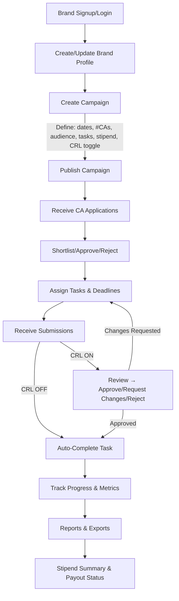
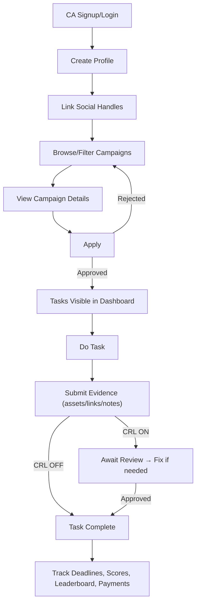
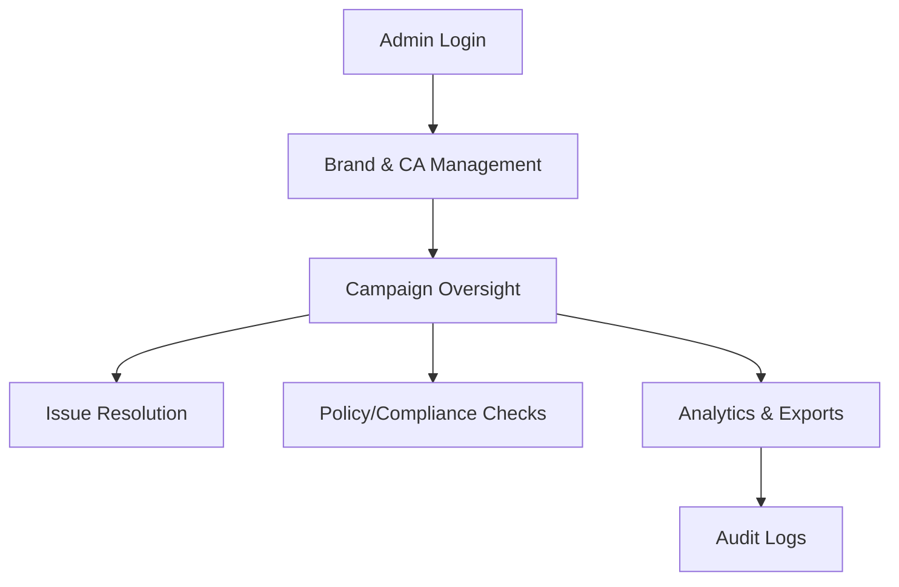

# CAMP — Campus Ambassador Management Platform

**Version:** v0.1 (Draft for Backend)

**Owner:** Lucky Kushwaha
**Date:** 2025-08-09 (IST)

---

## 0) Purpose

This document specifies the functional and non‑functional requirements for CAMP. It is written for the backend team to begin designing the database schema, APIs, background jobs, and integrations **without further verbal clarification**. Assumptions are explicitly called out. Anything not specified here should be raised as a question inline in PRs.

---

## 1) Product Overview

CAMP centralizes creation, execution, and tracking of multiple campus ambassador (CA) campaigns between three stakeholders:

* **Admin (Us):** Operate the platform, configure defaults, resolve issues, and oversee campaigns.
* **Brand:** Company running a campaign and funding stipends/rewards.
* **Campus Ambassador (CA):** Student user who applies to, executes, and reports on tasks.

High‑level capabilities:

1. Brand onboarding, profile, and **campaign creation**.
2. **CA onboarding**, social handle linking, campaign discovery, applications, task execution & submissions.
3. Optional **Content Review Loop** (pre‑live approval with feedback) per campaign.
4. Progress tracking, analytics, reports, payouts summary.
5. Notifications and SLA‑driven reminders.

---

## 2) Definitions

* **Campaign:** Time‑boxed initiative created by a Brand with target audience, CA requirements, tasks, stipend model, and reporting rules.
* **Task:** A unit of work assigned to CAs (e.g., Post on Instagram with #hashtag, submit screenshot+link).
* **Submission:** Evidence from CA that a Task is completed (assets, URLs, text, metrics).
* **Stipend Model:** Rules for payments (fixed, performance-based, mixed). Paid post‑campaign or milestone‑wise.
* **Content Review Loop (CRL):** If enabled, CA’s submissions go to Brand/Admin for approval before being marked complete (and optionally before going live externally).
* **Performance Metrics:** Impressions, views, reach, likes, comments, shares, clicks, etc., manually reported or fetched via API when available.

---

## 3) Core Objectives (Success Criteria)

* Centralized tracking across all campaigns and stakeholders.
* Frictionless onboarding & applications with clear eligibilities.
* Automated tasking, reminders, and review flows.
* Reliable, exportable reporting for Brands and Admin.

---

## 4) High‑Level Flows (Mermaid)

### 4.1 Brand Flow (Onboarding → Campaign → Review → Analytics)



### 4.2 CA Flow (Onboarding → Apply → Execute → Submit)



### 4.3 Admin Oversight Flow



---

## 5) Roles & Permissions (RBAC)

* **Admin:** Full read/write on everything; manage payouts config, policies, and escalations.
* **Brand Owner:** CRUD on own Brand profile; CRUD on own Campaigns; read CA applications to their campaigns; approve/reject; review submissions; read reports and payouts summary.
* **Brand Member:** Same as Owner but without destructive operations (e.g., delete campaign) and billing.
* **CA:** CRUD on own profile; apply to campaigns; view assigned tasks; create submissions; view payments and metrics for own work.

All write operations must be authorized and audited. Multi‑tenant boundary is **Brand ID**; CAs are global but scoped by campaign membership.

---

## 6) Functional Requirements (Detailed)

### 6.1 Authentication & Authorization

* Email/password + OAuth (Google) for **Brand** and **CA**. Admin via email/password + 2FA (TOTP).
* Session/JWT based auth. Refresh tokens with rotation. Device logout.
* Password reset via email. Email verification.
* RBAC middleware for every API.

### 6.2 Brand Profile

* Fields: name, logo, website, industry, description, HQ country, contact person {name, email, phone}, billing info {GST/VAT, address}, payout method preferences.
* Brand members: invite via email, role assignment (Owner/Member), revoke.

### 6.3 Campaign CRUD

* Fields (required unless noted):

  * brand\_id
  * title
  * description (rich text)
  * start\_date, end\_date
  * **min/max CAs required** (or exact number)
  * audience definition (age range, regions, interests, college(s), language)
  * influencer/CA eligibility (min followers per platform, year/branch optional)
  * platforms (Instagram, LinkedIn, YouTube, X, others)
  * tasks\[] (see 6.4)
  * stipend\_model (fixed | performance | mixed) + rules (see 6.7)
  * content\_review\_loop\_enabled (bool)
  * assets/guidelines (file links, brand kit, hashtags, captions library)
  * application\_window {open\_at, close\_at}
  * status: draft | published | running | paused | completed | archived

* Actions:

  * Publish (visible to eligible CAs)
  * Pause/Resume
  * Close applications
  * Archive after end\_date + retention policy

### 6.4 Tasks & Deadlines

* Each Task:

  * id, campaign\_id, title, instructions (rich text), required\_assets (types: image/video/pdf/screenshot/link), metrics\_to\_report (reach, views, likes, comments, clicks), deadline\_offset (days from approval) OR absolute deadline.
  * visibility: pre‑live (requires review) or post‑live (reporting only).
  * submission\_limit: 1 or many (if iterative).

* Assignment:

  * Default: all approved CAs get all campaign tasks.
  * Optional: segment tasks to subsets of CAs (future).

### 6.5 CA Applications

* CA can apply only during campaign.application\_window.
* Application includes: statement, portfolio links, preferred platforms, availability, (optional) custom questions.
* Brand can shortlist/approve/reject.
* Once approved, CA becomes **participant** and tasks are instantiated with deadlines.

### 6.6 Submissions & Content Review Loop (CRL)

* Submission includes: task\_id, files\[], links\[], text\_notes, auto‑captured timestamps, optional structured metrics.
* If CRL = true:

  * State machine: `draft → submitted → under_review → changes_requested → resubmitted → approved → completed` | `rejected`.
  * Only **approved** moves task to **completed**.
* If CRL = false:

  * State machine: `draft → submitted → auto_completed` (Admin may still soft‑moderate).
* All transitions audited (who, when, from→to, comment).
* Feedback threads per submission (Brand/Admin ↔ CA). Markdown allowed.

### 6.7 Stipend Models & Payout Summary

* **Fixed:** amount\_per\_CA, release rule (on campaign completion or per‑task milestone%).
* **Performance:** metrics\_formula (e.g., `₹x per 1000 impressions`, caps), verification method (manual/API).
* **Mixed:** base fixed + performance top‑up.
* Payouts **summary** in platform; actual disbursement initially **off‑platform** (manual) with status tracking: pending → initiated → paid → failed.
* Export CSV/PDF for finance.

### 6.8 Metrics & Analytics

* For each submission/task/CA/campaign: store reported metrics (numbers, date collected, source manual/API). Keep history for updates.
* Campaign dashboards aggregate: completion %, reach, engagement, top CAs, lagging tasks.
* Brand can filter by date range, platform, college, region.

### 6.9 Notifications & Reminders

* Channels: email + in‑app (push later). WhatsApp/SMS optional later.
* Triggers:

  * CA approved → tasks assigned.
  * Task due in 48h/24h/6h.
  * Submission reviewed (approved/rejected/changes requested).
  * Campaign status changes (paused/resumed).
  * Application outcomes.
* Quiet hours configurable (future).

### 6.10 Reporting & Exports

* CSV & PDF for: applications, participants, task status, metrics, payout summary.
* Brand‑scoped; Admin can export cross‑brand.
* Include generated at timestamp and filters metadata.

### 6.11 Issue Resolution

* Ticket entity: {id, scope(campaign|submission|payout|profile), opened\_by, assigned\_to(Admin), status, comments, attachments}.
* SLA timers for Admin dashboard.

### 6.12 Auditing & Compliance

* Audit log for all sensitive actions with user\_id, ip, ua, before/after snapshots where applicable.
* Content retention policy (e.g., delete media after N days post‑campaign, configurable per brand/legal).

---

## 7) Data Model (First‑Pass Entities)

**User** {id, role\[admin|brand\_owner|brand\_member|ca], email, password\_hash, name, phone, status, created\_at, updated\_at}

**Brand** {id, owner\_user\_id, name, logo\_url, website, industry, description, hq\_country, contact{name,email,phone}, billing{gst\_vat,address}, payout\_prefs, created\_at, updated\_at}

**BrandMember** {id, brand\_id, user\_id, role\[owner|member], invited\_at, accepted\_at}

**CAProfile** {id, user\_id, college, year, branch, city, bio, skills\[], verification\_status, created\_at, updated\_at}

**SocialHandle** {id, ca\_profile\_id, platform, username, url, followers, token\_meta(json, nullable), last\_synced\_at}

**Campaign** {id, brand\_id, title, description, start\_date, end\_date, min\_cas, max\_cas, audience(json), eligibility(json), platforms\[], assets\[], application\_window{open\_at,close\_at}, stipend\_model(enum), stipend\_rules(json), crl\_enabled(bool), status(enum), created\_at, updated\_at}

**Task** {id, campaign\_id, title, instructions, required\_assets(json), metrics\_schema(json), deadline\_offset\_days(int, nullable), absolute\_deadline(datetime, nullable), visibility(enum: pre\_live|post\_live), submission\_limit(int), created\_at}

**Application** {id, campaign\_id, ca\_profile\_id, statement, portfolio\_links\[], answers(json), status(enum: pending|shortlisted|approved|rejected), decided\_by, decided\_at, created\_at}

**Participant** {id, campaign\_id, ca\_profile\_id, approved\_by, approved\_at, status(active|removed|completed)}

**AssignedTask** {id, participant\_id, task\_id, due\_at, state(enum: open|submitted|under\_review|changes\_requested|resubmitted|approved|completed|rejected|auto\_completed), last\_transition\_at}

**Submission** {id, assigned\_task\_id, files\[], links\[], notes, metrics(json\[] history), state\_mirror(enum), reviewed\_by, reviewed\_at, feedback\_thread\_id}

**PayoutRecord** {id, campaign\_id, participant\_id, model(enum), calc\_snapshot(json), amount, currency, status(pending|initiated|paid|failed), external\_ref, created\_at, updated\_at}

**Ticket** {id, scope, ref\_id, opened\_by, assigned\_to, status, comments\[], attachments\[], created\_at, updated\_at}

**AuditLog** {id, actor\_user\_id, action, entity, entity\_id, before(json), after(json), ip, ua, at}

Indexes to plan for: campaign\_id on most tables; (campaign\_id, ca\_profile\_id) composite; status/date filters; text search on campaign title/description.

---

## 8) API Contract (v1 — Draft)

Base URL prefix: `/api/v1`

### Auth

* `POST /auth/signup` {role} → 201 {user}
* `POST /auth/login` → 200 {access\_token, refresh\_token}
* `POST /auth/refresh` → 200 {access\_token}
* `POST /auth/logout` → 204
* `POST /auth/password/reset-request` → 204
* `POST /auth/password/reset` → 204

### Brands

* `POST /brands` (Owner) → 201 {brand}
* `GET /brands/:id` → 200 {brand}
* `PATCH /brands/:id` → 200 {brand}
* `POST /brands/:id/members` invite → 202
* `DELETE /brands/:id/members/:userId` → 204

### Campaigns

* `POST /brands/:brandId/campaigns` → 201 {campaign}
* `GET /brands/:brandId/campaigns` (filters: status, q, date\_range) → {items\[], total}
* `GET /campaigns/:id` → {campaign, tasks\[]}
* `PATCH /campaigns/:id` → {campaign}
* `POST /campaigns/:id/publish` | `/pause` | `/resume` | `/close-applications` | `/archive` → 200

### Tasks

* `POST /campaigns/:id/tasks` → 201 {task}
* `GET /campaigns/:id/tasks` → {items\[]}
* `PATCH /tasks/:taskId` → {task}

### Applications (CA)

* `POST /campaigns/:id/applications` → 201 {application}
* `GET /campaigns/:id/applications` (Brand/Admin) → {items\[]}
* `POST /applications/:id/decision` body: {status: shortlisted|approved|rejected} → 200

### Participants & Assignment

* `GET /campaigns/:id/participants` → {items\[]}
* `POST /campaigns/:id/participants/:applicationId/approve` → 201 {participant}
* **Auto‑assignment job** creates AssignedTasks per participant on approval.

### Submissions & CRL

* `POST /assigned-tasks/:id/submissions` (CA) multipart → 201 {submission}
* `GET /assigned-tasks/:id/submissions` → {items\[]}
* `POST /submissions/:id/review` (Brand/Admin) {action: approve|request\_changes|reject, comment} → 200
* `POST /submissions/:id/resubmit` (CA) → 200

### Metrics & Reporting

* `POST /submissions/:id/metrics` {metrics\[]} → 200
* `GET /campaigns/:id/analytics` (Brand/Admin) → {summary, charts}
* `GET /campaigns/:id/exports` (type=csv|pdf, scope) → file

### Payouts (Summary Only v1)

* `GET /campaigns/:id/payouts` → {records\[], totals}
* `POST /campaigns/:id/payouts/reconcile` (Admin) → 200

### Tickets

* `POST /tickets` → 201 {ticket}
* `GET /tickets` (filters) → {items\[]}
* `PATCH /tickets/:id` → {ticket}

### Notifications

* Internal event bus; expose `GET /me/notifications` and mark‑as‑read endpoint.

---

## 9) Background Jobs & Schedulers

* **Auto‑assignment** of tasks upon CA approval.
* **Deadline reminders** (48h/24h/6h) → enqueue notifications.
* **Campaign state transitions** (auto mark completed after end\_date if no pending reviews and all tasks resolved).
* **Data retention cleanup** of media after policy window.
* **Metrics sync** (future, when social APIs are connected).

---

## 10) Validation & Business Rules

* A CA cannot apply twice to the same campaign while status in {pending, shortlisted, approved}.
* Changing `crl_enabled` on a running campaign affects only **new** submissions (existing stay in their current state).
* Deleting a campaign is **soft delete**; archived campaigns are read‑only except exports.
* Files: limit size per file (config, default 25MB), allowed mime types.
* Metrics are immutable per snapshot entry; allow additional snapshots with timestamps.

---

## 11) Non‑Functional Requirements

* **Security:** OWASP Top 10, rate limiting, S3 signed URLs for media, PII encryption at rest (contact phone/email). Audit logging.
* **Performance:** P95 < 300ms for reads, < 700ms for writes (excluding media upload). Pagination everywhere.
* **Scalability:** Horizontal scale API; object storage for media; separate analytics store (OLAP) if needed.
* **Reliability:** 99.9% uptime target; idempotency keys for upload & review actions.
* **Observability:** Structured logs, traces, metrics; admin dashboards for job queues.

---

## 12) Admin Console Requirements

* Global search (brands, campaigns, CAs, tickets).
* Campaign health: pending reviews, overdue tasks, top performers, at‑risk campaigns.
* Manual overrides for submission states with reason.

---

## 13) MVP Acceptance Criteria

1. Brand can create profile and at least one campaign with tasks, stipend model, and CRL toggle.
2. CA can sign up, link handles (no API tokens required in MVP), browse, apply, and on approval receive tasks with deadlines.
3. CA can upload submissions; if CRL is ON, brand can approve/request changes/reject; if OFF, auto‑complete.
4. Dashboards show per‑campaign progress (assigned, submitted, approved, completed), and simple totals for metrics (manual entry allowed).
5. Exports (CSV) for participants, tasks status, and payout summary.
6. Notifications: email for approvals, reviews, and deadlines.
7. All state transitions are audited.

---

## 14) Open Questions (for Issue Tracker)

* Do we need per‑task **caps** on performance payouts at MVP?
* Should we allow **partial approvals** within a multi‑asset submission?
* Any legal requirements for storing CA identity docs/KYC for payouts?

---

## 15) Future Enhancements (Post‑MVP)

* Social API integrations (Instagram Graph, LinkedIn) for metrics verification & direct publishing.
* Gamification: XP, badges, streaks, rewards store.
* AI moderation (NSFW/brand kit matching, caption sentiment, guideline enforcement).
* Smart CA recommendations for brands based on past performance.
* Wallet + automated payouts (UPI).

---

## 16) Appendix — Sample Objects (JSON)

### 16.1 Campaign (create)

```json
{
  "brand_id": "b_123",
  "title": "Freshers' Week Push",
  "description": "Drive 10k impressions across 5 colleges.",
  "start_date": "2025-09-01",
  "end_date": "2025-09-30",
  "min_cas": 30,
  "max_cas": 50,
  "audience": {"regions": ["Delhi NCR"], "interests": ["college fests"], "age": {"min": 17, "max": 24}},
  "eligibility": {"instagram_followers_min": 800},
  "platforms": ["instagram", "linkedin"],
  "assets": ["s3://kits/brand123/kit.zip"],
  "application_window": {"open_at": "2025-08-15T00:00:00Z", "close_at": "2025-08-25T23:59:59Z"},
  "stipend_model": "mixed",
  "stipend_rules": {"fixed": 1000, "performance": {"per_1000_impressions": 50, "cap": 5000}},
  "crl_enabled": true,
  "status": "draft"
}
```

### 16.2 Task (create)

```json
{
  "title": "IG Post: Freshers' Reel",
  "instructions": "Use brand music, include hashtags #Freshers #BrandX, mention @brandx.",
  "required_assets": {"types": ["video", "screenshot"], "notes": "Upload final reel and analytics screenshot after 48h"},
  "metrics_schema": ["reach", "views", "likes", "comments"],
  "deadline_offset_days": 5,
  "visibility": "pre_live",
  "submission_limit": 2
}
```

### 16.3 Submission (create)

```json
{
  "links": ["https://instagram.com/p/abc"],
  "files": ["s3://uploads/ca_45/reel.mp4", "s3://uploads/ca_45/analytics.png"],
  "notes": "Posted at 7pm peak time.",
  "metrics": [{"collected_at": "2025-09-10T10:00:00Z", "reach": 2400, "views": 2600, "likes": 310, "comments": 22}]
}
```

---

**End of v0.1**
